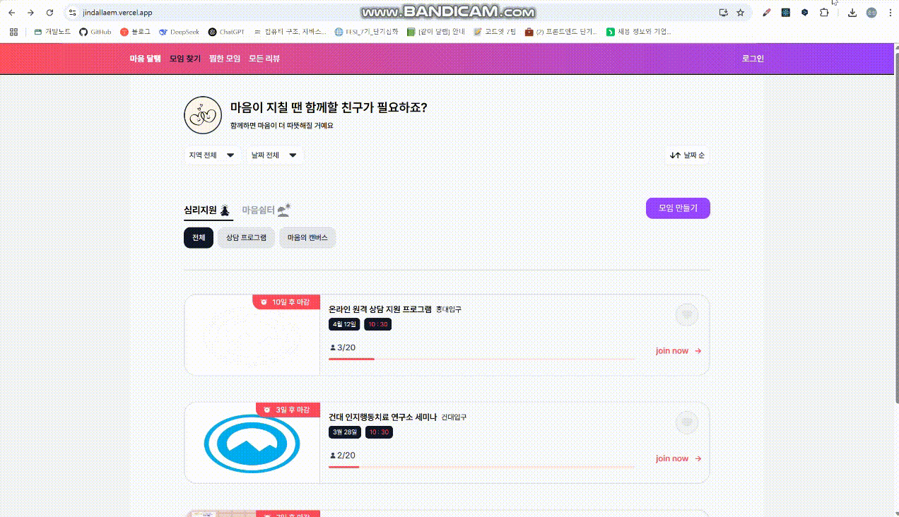
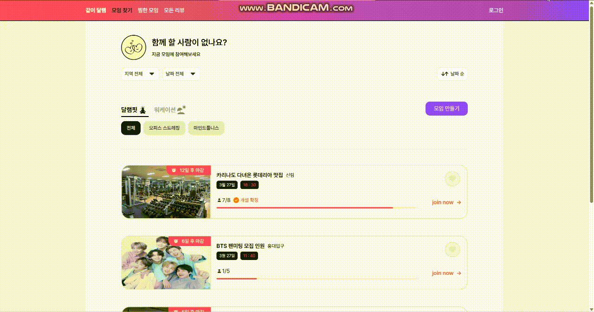
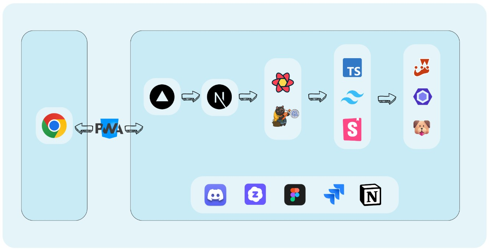

# 함께라서 더 빛나는 마음, 마음의 쉼표 ⭐**마음 달램**⭐


<br />
<br />

## 🎶 목차

- [🎯 프로젝트 소개](#-프로젝트-소개)
- [🔧 기술 스택](#-기술-스택)
- [💖 역할 분담](#-역할-분담)
- [📺 기능 소개](#-페이지별-기능-소개)
- [📜 디렉토리 구조](#-디렉토리-구조)
- [🧩 컨벤션](#-컨벤션)
- [🌱 세부 기술 스택과 채택한 이유](#-세부-기술-스택과-채택한-이유)
- [🙇‍♂️ 유저 플로우 차트](#-유저-플로우-차트)
- [🖥️ 화면 흐름도](#-화면-흐름도)
- [💾 시스템 아키텍처](#-시스템-아키텍처)
- [📖 산출물](#-산출물)
- [📝 프로젝트 회고](#-프로젝트-회고)

<br />

## 🎬 시연 영상

<a style="text-align: center;" href="https://youtube.com/">

</a>

> _위의 영상을 누르면 시연 영상으로 이동됩니다._ >

 <br />

## ✨ 프로젝트 소개

### 함께라서 더 빛나는 마음, **마음 달램**

> 마음 달램은 바쁜 일상 속에서 심리 상담과 취미 활동을 하나의 플랫폼에서 연결하여 보다 자연스럽게 정신적 건강을 관리할 수 있는 웹/앱 기반 반응형 플랫폼입니다.

### 🔹 주요 기능

**✅ 모임 탐색 및 참여**

- 다양한 카테고리의 모임을 확인하고 자유롭게 참여 가능합니다.
- 심리지원 / 마음쉼터 두 영역으로 원하는 모임을 필터링을 통해 찾을 수 있습니다.

**✅ 모임 개설**

- 회원이라면 누구나 쉽게 오프라인 모임을 생성 및 관리를 할 수 있습니다.
- 회원만 모임 생성을 할 수 있습니다.

**✅ 리뷰 작성**

- 모임 참여 후 경험을 공유하거나 피드백을 남길 수 있습니다.
- 1 ~ 5개의 하트를 통해서 점수를 매길 수 있습니다.

**✅ 반응형 UI**

- 웹 및 모바일 환경에서 최적화된 사용자 경험 제공합니다.

**✅ 로그인/비로그인 지원**

- 토큰 기반 인증 시스템을 활용하여 로그인 없이도 일부 기능 이용 가능

<br>

## 🔥 기술 스택

**⚛️ 프론트엔드**

<div>      </div>

<br/>

**🚀 배포 및 CI/CD**

<div>   </div>

<br />

**🤝 협업 도구**

<div>      </div>

<br>

## 👥 역할 분담

| 담당자 | 업무                                                                                                                               | 비고                                                                                 |
| ------ | ---------------------------------------------------------------------------------------------------------------------------------- | ------------------------------------------------------------------------------------ |
| 심우석 | 팀장 </br> 모임 상세 페이지 담당 </br> 페이지네이션 </br> 찜하기 기능 </br> 공통 컴포넌트 제작                                     | 지라 툴 관리 </br> PWA 환경설정 </br>프로젝트 중간 발표                              |
| 박준성 | 모임 찾기 페이지 담당(홈 페이지) </br> 모임 만들기 기능 담당 </br> 프로젝트 초기 설정 및 폴더 구조 설정 </br> CI/CD 배포 담당 개발 | 리드미 작성 </br>무한스크롤 구현 </br> 패럴렐 라우트 모달 기능 구현                  |
| 박채은 | 리뷰 페이지 담당 </br> 페이지 별 네비게이션 담당 </br> 데이터 필터링 컴포넌트 담당 </br> 서기 담당                                 | 무한스크롤 구현 </br>페이지별 필터링 관리 </br> PPT 발표자료 준비 </br> 시연영상     |
| 황선영 | 로그인 페이지 담당 </br> 회원가입 페이지 담당 </br> GNB 담당 </br> 참여인원 프로필 모음 컴포넌트 개발                              | Zustand persist를 사용하여 유저 관리 </br> 로그인, 회원가입 유효성 검사 </br>        |
| 안예지 | 마이페이지 담당 </br> 찜한 모임 페이지 담당 </br> 프로필 수정 기능 담당 </br> 리뷰 작성 기능 담당 </br> 스크럼 마스터 담당         | api 공통화 </br> 유저 로직 공통화 </br> 모달 컴포넌트 공통화 </br> PPT 발표자료 준비 |

<br />

<br>

## 📖 페이지별 기능 소개

<br>

### ⭐ 메인 페이지

- 비회원 유저가 사이트를 이용할 수 있고, 모임 상세 페이지, 모든 리뷰 페이지를 확인할 수 있습니다.
- 비회원/회원으로 찜하기 기능을 사용할 수 있습니다.
- 비로그인 시 모임 만들기 기능을 클릭하면 모달창이 생성되어 로그인 페이지로 이동합니다.
- 로그인 상태라면 모임 만들기 기능을 할 수 있습니다.
- 필터링 기능을 사용할 수 있습니다.
- 데이터베이스에 저장된 데이터를 가져올 때 초기 데이터 5개는 SSR 방식으로 데이터 패칭 후 그 이후 데이터는 CSR 방식으로 무한스크롤 기능이 동작됩니다.

| 메인 페이지                                                   |
| ------------------------------------------------------------- |
|  |

<br />

---

<br />
<br />

### ⭐ 상세 페이지

- 비회원/회원으로 찜하기 기능을 사용할 수 있습니다.
- 모임을 만든 주최자라면 모임을 취소 혹은 공유를 할 수 있습니다.
- 주최자가 아닌 일반 회원이라면 모임을 확인 후 참여할 수 있습니다.

| 상세 페이지                                                   |
| ------------------------------------------------------------- |
|  |

<br />

---

<br />

### ⭐ 로그인, 회원가입 페이지

- 비회원이라면 회원가입 페이지에서 유효성 검사를 마친 후 회원가입을 할 수 있습니다.
- 회원가입을 마친 후 로그인 페이지에서 유효성 검사를 마친 후 로그인을 할 수 있습니다.

| 로그인 페이지                                                             |
| ------------------------------------------------------------------------- |
|  |

<br />

---

<br />

### ⭐ 모든 리뷰 페이지

- 비회원으로 모든 리뷰를 확인할 수 있습니다.
- 필터링 기능을 사용할 수 있습니다.
- 데이터베이스에 저장된 데이터를 가져올 때 초기 데이터 5개는 SSR 방식으로 데이터 패칭 후 그 이후 데이터는 CSR 방식으로 무한스크롤 기능이 동작됩니다.

| 리뷰 페이지                                                         |
| ------------------------------------------------------------------- |
|  |

<br />

---

<br />

### ⭐ 찜한 페이지

- 비회원/회원으로 찜한 모임 목록 리스트를 확인할 수 있습니다.
- 필터링 기능을 사용할 수 있습니다.
- 찜하기 기능을 해제할 수 있습니다.

| 찜한 페이지                                                    |
| -------------------------------------------------------------- |
|  |

<br>

---

<br>

### ⭐ 마이 페이지

- 회원 기능으로 로그인 시 마이페이지를 확인할 수 있습니다.
- 나의 모임을 확인할 수 있습니다.
- 나의 리뷰를 작성할 수 있습니다.
- 내가 만든 모임을 확인할 수 있습니다.
- 나의 정보를 수정할 수 있습니다.

| 마이 페이지                                                    |
| -------------------------------------------------------------- |
|  |

<br>

---

<br>

## 📂 디렉토리 구조

```
📦 프로젝트 루트
├── 📂 .github
├── 📂 .husky
├── 📂 .next
├── 📂 .storybook
├── 📂 .swc
├── 📂 .vscode
├── 📂 coverage
├── 📂 node_modules
├── 📂 public
├── 📂 src
│   ├── 📂 api
│   ├── 📂 app
│   │   ├── 📂 (auth)
│   │   │   ├── 📂 login
│   │   │   │   └── 📄 page.tsx
│   │   │   ├── 📂 signup
│   │   │   │   └── 📄 page.tsx
│   │   ├── 📂 (home)
│   │   │   ├── 📂 _components
│   │   │   ├── 📂 @createmodal
│   │   │   │   ├── 📂 createmodal
│   │   │   │   │   ├── 📄 default.tsx
│   │   │   │   │   ├── 📄 page.tsx
│   │   │   │   ├── 📄 default.tsx
│   │   │   ├── 📂 all-reviews
│   │   │   │   ├── 📂 _components
│   │   │   │   ├── 📄 page.tsx
│   │   │   ├── 📂 favorite-meetings
│   │   │   │   ├── 📂 _components
│   │   │   │   ├── 📄 page.tsx
│   │   │   ├── 📂 meeting
│   │   │   │   ├── 📂 _components
│   │   │   │   ├── 📂 [id]
│   │   │   │   │   ├── 📄 page.tsx
│   │   │   ├── 📂 mypage
│   │   │   │   ├── 📂 @profile
│   │   │   │   ├── 📂 @review
│   │   │   │   ├── 📂 _components
│   │   │   │   ├── 📂 create-review
│   │   │   │   ├── 📂 createdMeetings
│   │   │   │   ├── 📂 meetings
│   │   │   │   ├── 📂 my-profile
│   │   │   │   ├── 📂 reviews
│   │   │   │   ├── 📄 page.tsx
│   │   ├── 📄 globals.css
│   │   ├── 📄 layout.tsx
│   │   ├── 📄 not-found.tsx
│   ├── 📂 components
│   ├── 📂 constants
│   ├── 📂 hooks
│   ├── 📂 lib
│   ├── 📂 service
│   ├── 📂 store
│   ├── 📂 stories
│   ├── 📂 types
│   ├── 📂 utils
├── 📄 .env.local
├── 📄 .gitignore
├── 📄 .prettierrc.js
├── 📄 codecov.yml
├── 📄 cody.json
├── 📄 commitlint.config.js
├── 📄 eslint.config.mjs
├── 📄 jest.config.ts
├── 📄 next-env.d.ts
├── 📄 next.config.ts
├── 📄 package-lock.json
├── 📄 package.json
├── 📄 postcss.config.mjs
├── 📄 README.md
├── 📄 tailwind.config.ts
├── 📄 tsconfig.json
├── 📄 vitest.config.ts
├── 📄 vitest.shims.d.ts


```

---

<br>

## 📜 컨벤션

### 🔹 PR 템플릿 활용

- 브랜치명은 기능 또는 수정 사항을 명확히 반영하도록 설정
- 한 PR당 코드 변경 사항 300줄 이하로 제한
- 코드리뷰는 1명이상 approve 승인을 받아야 머지 가능(1~2시간 내 리뷰 완료)

### 🔹 Husky

- 커밋 메시지에만 적용
- 커밋 메시지 스타일을 통일하고 역할을 분리하는 데 집중

### 🔹 ES Lint

- 코드 스타일 및 일관성을 유지하기 위한 룰 설정 후 느슨한 적용 중

### 🔹 스크럼

- 오전 / 오후 2회 진행(각 15분 미만)

</br>

---

## 🔧 세부 기술 스택과 채택한 이유

### 

## - Next.js 15버전 채택 이유 :

1. 프로젝트 성능 최적화에 유리함
2. Next.js 13 부터 도입된 App router가 15버전에서 안정화 되었기에 선정
3. 기본적으로 모든 페이지가 SSR(Server-Side Rendering) 방식으로 렌더링됨
4. 따라서 초기 로딩 속도 개선되어 최적화에 유리
5. 적재적소에 CSR 컴포넌트를 사용해 필요한 시점에만 데이터를 가져와서 캐싱 가능

</br>
</br>
</br>
</br>


## - Zustand 상태 관리 라이브러리 채택 이유 :

1. 다른 상태 관리 라이브러리에 비해 번들 크기가 매우 작고 빠르며, 가벼운 상태 관리가 가능하기에 선정
2. Provider로 감싸지 않고 바로 전역에서 사용할 수 있어 설정이 간단하고 학습 난이도가 낮아서 선정
3. 상태 관리의 복잡도를 최소화하며, 단순하고 직관적인 API를 제공해 빠르게 구현할 수 있음

</br>
</br>
</br>
</br>

 

## - Tanstack Query 상태 관리 라이브러리 채택 이유 :

1. useQuery를 사용하여 데이터를 처음 요청하면 데이터를 캐시에 저장하고, 이후 동일한 키로 요청하면 캐시에 저장된 데이터를 반환하여 서버 호출을 줄여 성능을 최적화할 수 있어 선정
2. useEffect의 의존성 배열을 관리할 필요 없이, useMutation을 사용하여 데이터를 업로드하면 해당 데이터가 변경된 후 자동으로 캐시된 데이터나 관련된 쿼리가 갱신되어 최신 데이터를 반영합니다. 이를 통해 새로고침 없이도 데이터가 자동으로 업데이트 되기에 선정
3. 비동기 요청 시 isPending, isError, isFetching 등 내장된 기능을 사용하여 비동기 처리를 손쉽게 설정 가능
4. 무한스크롤 및 페이지네이션과 같은 데이터 페이징 처리를 쉽게 구현 가능
5. prefetchQuery 혹은 prefetchInfiniteQuery를 사용해 서버에 저장된 데이터를 ssr 방식으로 미리 패칭하여 빌드 시점에 정보가 담긴 HTML 파일을 사용할 수 있어 성능 최적화에 유리

</br>
</br>
</br>
</br>
</br>


## - Tailwind CSS 유틸리티 기반 접근 방식 선택 이유 :

1. 유틸리티 스타일을 제공하여 CSS 파일을 별도로 작성할 필요 없이 빠른 스타일링이 가능하여 생산성이 향상되어 선택
2. Tailwind JIT(Just-in-Time) 컴파일러는 미리 컴파일하지 않고, 필요할 때만 컴파일을 진행해 이는 곧 CSS 파일 크기가 작아져, 웹 페이지 로딩 속도가 빨라 성능 최적화에 유리함으로 선택
3. Next.js의 트리 셰이킹과 결합하면 더욱 가벼운 스타일 파일을 유지할 수 있기에 선택
   - 트리 셰이킹이란 : 사용하지 않은 스타일 클래스들을 제거하여 CSS 파일 크기를 줄임임
4. Tailwind는 Next.js의 동적 클래스 적용과 궁합이 좋아 clsx 라이브러리를 함께 사용하면 조건부 스타일링이 쉽게 구현이 가능함으로 선택

</br>
</br>
</br>
</br>
</br>


## - Github Actions 사용 이유 :

1. 자동화된 CI/CD 파이프라인을 구축하여 코드가 푸쉬되면 자동으로 빌드, 테스트, 배포가 진행되어 배포 과정에서 에러나 실수를 줄이고, 신속한 피드백을 통해 개발 효율성이 증가함으로 선택
2. 자동화된 테스트와 코드 품질 관리를 통해 협업 시 다른 팀원들의 코드 품질을 신경 쓰지 않아도 일정 수준 이상의 품질을 유지할 수 있도록 도와 선택

</br>
</br>
</br>
</br>
</br>


## - Jira 사용 이유 :

1. 각자 팀 내에서 작업할 항목을 에픽으로 나누고, 에픽에 대한 세부 작업을 백로그에 관리할 수 있어 다른 팀원들의 작업의 우선순위와 진행 상황 추적이 용이하여 선택
2. 1주일 단위 스프린트를 진행하여 스프린트가 종료될 때 회고를 통해 어떠한 문제가 있었는지, 무엇을 더 해야하는지 쉽게 파악할 수 있기에 선택
3. 그래프를 통해 진행이 잘 되었는지 파악하기 수월하기에 선택

</br>
</br>
</br>
</br>
</br>

## 🏄 유저 플로우 차트


<br>

</br>

## 📺 화면 흐름도


<br>

</br>

## 💾 시스템 아키텍처



</br>
</br>
</br>

## 👀 산출물

### ⭐ [컴포넌트 명세서](https://www.notion.so/18579e4031a6808c97cae5f2897cdf4d?v=18579e4031a680908082000c5b59b975)

### ⭐ [트러블 슈팅](https://www.notion.so/Bug-Fix-18579e4031a680eba490d6a69105fb4e)

### ⭐ [개발 컨벤션](https://www.notion.so/18579e4031a68079a0e8f78ec9dacb65)

</br>
</br>
</br>

## 📝 프로젝트 회고

### 목표 및 동기

- 팀 프로젝트 시작 전 성능 최적화 및 코드 품질 개선을 하는것을 목표로 정했습니다.
- 코드 스타일, 폴더 구조, 커밋 메시지 규칙 등 명확한 컨벤션을 정하여 체계적이고 효율적인 협업을 통하여 협업 능력을 기르는것을 목표로 정했습니다.

### 진행 과정

- 초기 기획 단계에서 데일리 스크럼을 통하여 각자의 역할 분담을 정하고 어떠한 기술 스택을 사용할 지 자료조사를 통하여 토론 후 기술 스택 선정했습니다.
- 이후 figma, notion, jira, discord, zep 툴을 활용하여 프로젝트의 관한 내용을 기록하며 문서화 했습니다.
- 프로젝트 목표중 하나였던 최적화를 위해서 초기 개발은 csr 방식으로 개발하였으며, 성능 측정 이후 ssr 방식으로 리팩토링을 거쳐 어떠한 지표가 성능 최적화가 되었는지 진행했습니다.

### 기술적 도전과 배운 점

- Next.js App Router를 활용한 SSR과 CSR의 조합
- Zustand를 활용한 전역 상태 관리
- React Query의 key 값을 활용한 데이터 및 prefetch 기능을 활용하여 필요한 데이터를 미리 로드해 사용자 경험을 향상
- CI/CD 구축 (Vercel + GitHub Actions)

### 협업 경험

- Jira를 이용한 애자일 방식의 스프린트 진행
- GitHub PR 리뷰를 적극적으로 활용하여 코드 품질 향상
- Notion을 활용한 문서화 및 일정 관리

### 향 후 프로젝트 개선할 점

- 폰트 덜렁거림 개선
- 중복 코드 제거
- 공통 컴포넌트 비중 높이기
- custom hook 재사용성 높이기

### 소감 및 성장

이번 프로젝트를 통해 **성능 최적화, 협업 방식 개선** 등의 기술적 성장을 이룰 수 있었습니다. 또한, **팀원들과의 원활한 소통이 프로젝트의 성공에 중요한 요소**임을 다시 한번 깨닫게 되었습니다.
